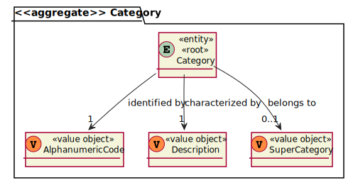
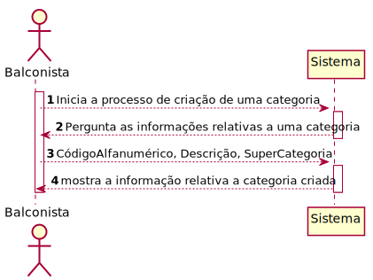
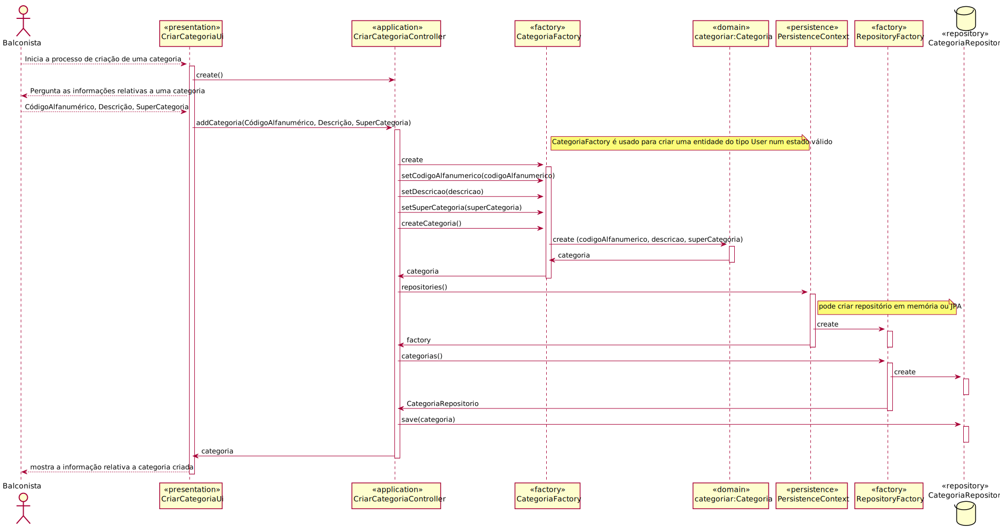
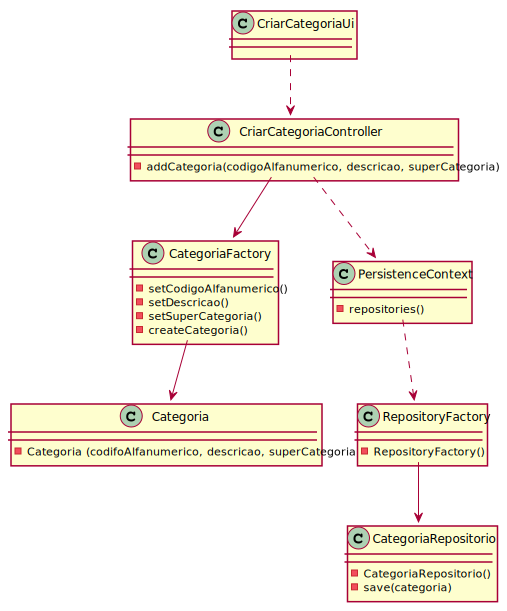

# US1005 -Como Balconista, quero definir uma nova categoria de produtos.
=======================================

# 1. Requisitos

**US1005** Como {Balconista} pretendo...

- US1005.1- definir uma nova categoria de produtos 

A interpretação feita deste requisito foi a seguinte:

Como sou um balconista, ou seja, um ator do sistema, precisso acessar ao sistema para poder criar categorias para os produtos.

# 2. Análise

- Após a análise da US concluiu-se que não existiam quaisqueres dependências para outras funcionalidades das US's.

## Exerto do modelo de domínio

# 3. Design

- Para o dsenvolvimento dessa US foram aplicados os padrões de 'design' DDD (Domain Drive Design).

## 3.1. Realização da Funcionalidade

### Diagrama de sequência do sistema

### Diagrama de sequência 

## 3.2. Diagrama de Classes

## 3.3. Padrões Aplicados

- Controller - ["A utilização do padrão Controller traz como benefício o isolamento das regras de negócios da lógica de apresentação, que é a interface com o usuário. Isto possibilita a existência de várias interfaces com o usuário que podem ser modificadas sem a necessidade de alterar as regras de negócios, proporcionando muito mais flexibilidade e oportunidades de reuso das classes."](https://www.devmedia.com.br/introducao-ao-padrao-mvc/29308#MVC)

- Creator - ["A criação de objetos é uma das mais comuns atividades em um sistema orientado a objetos. Descobrir qual classe é responsável por criar objetos é uma propriedade fundamental da relação entre objetos de classes particulares."](https://pt.wikipedia.org/wiki/GRASP_(padr%C3%A3o_orientado_a_objetos)#Creator_(criador))

- Repository - ["É uma forma de abstrair a persistência de dados. Ele deixa o mecanismo de como os dados são acessados isolados das regras de negócio. Não é a entidade e não é a conexão que faz a persistência, é o repositório, que é uma classe independente com as responsabilidades desacopladas."](https://pt.stackoverflow.com/questions/101692/como-funciona-o-padr%C3%A3o-repository)

- Factory - ["É um padrão de projeto de software (design pattern, em inglês) que permite às classes delegar para subclasses decidirem, isso é feito através da criação de objetos que chamam o método fabrica especificado numa interface e implementado por um classe filha ou implementado numa classe abstrata e opcionalmente sobrescrito por classes derivadas."](https://pt.wikipedia.org/wiki/Factory_Method)

- Persistence Context

## 3.4. Testes
*Nesta secção deve sistematizar como os testes foram concebidos para permitir uma correta aferição da satisfação dos requisitos.*

**Teste 1:** Verificar que não é possível criar uma instância da classe Exemplo com valores nulos.

	@Test(expected = IllegalArgumentException.class)
		public void ensureNullIsNotAllowed() {
		Exemplo instance = new Exemplo(null, null);
	}

# 4. Implementação

*Nesta secção a equipa deve providenciar, se necessário, algumas evidências de que a implementação está em conformidade com o design efetuado. Para além disso, deve mencionar/descrever a existência de outros ficheiros (e.g. de configuração) relevantes e destacar commits relevantes;*

*Recomenda-se que organize este conteúdo por subsecções.*

# 5. Integração/Demonstração

*Nesta secção a equipa deve descrever os esforços realizados no sentido de integrar a funcionalidade desenvolvida com as restantes funcionalidades do sistema.*
