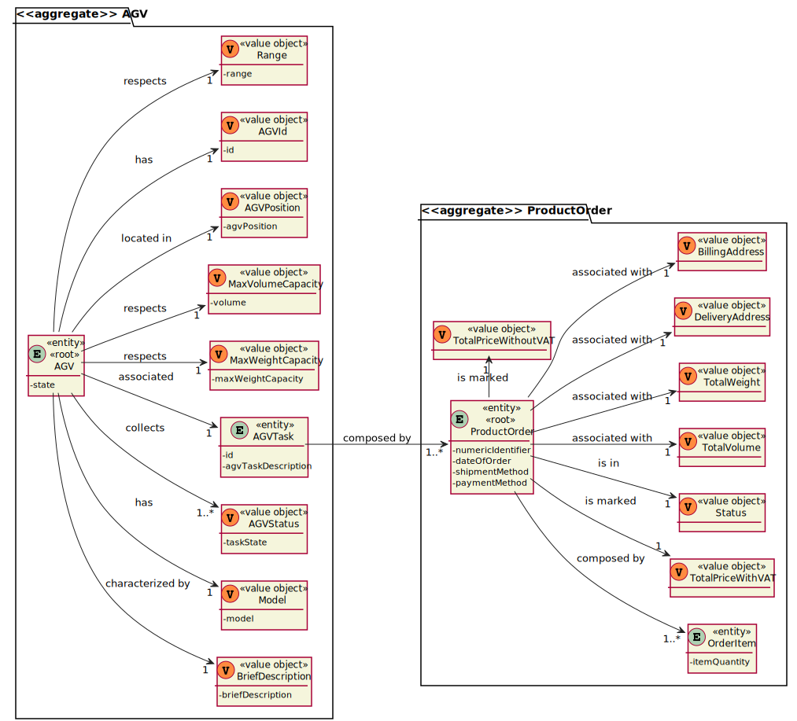

# US2004 - Como Funcionário do Armazém, quero acessar a lista de pedidos que já foram preparados pelos AGVs e poder atualizar qualquer um desses pedidos como tendo sido despachado para entrega ao cliente.
=======================================

# 1. Requisitos

**US1005** Como {Funcionário do Armazém} pretendo...

- US2004.1- Acessar a lista de pedidos que já foram preparados pelos AGV's 
- US2004.2- Atualizar o estado de um pedido para 'despachado para o cliente'
- 
A interpretação feita deste requisito foi a seguinte:

Como sou um Funcionário do Armazém, ou seja, um ator do sistema, precisso acessar ao sistema para visualizar os pedidos que já foram preparados pelos AGV's e atualizar o seu estado.

### 1.1 Especificações e esclarecimentos do cliente

> [Question:](https://moodle.isep.ipp.pt/mod/forum/discuss.php?d=16327)
> Dear Client,
After analyzing the User Story 2004 the following doubts came to me:
What do you mean by filtering the list by AGV? Do you mean the list of Product Orders ordinated by AGV name?
> 
> [Awnser:](https://moodle.isep.ipp.pt/mod/forum/discuss.php?d=16327)
> Orders, soon or later, will be assigned as tasks to AGVs operating on the warehouse (defined on US 2002). Some orders will be assigned, for instance, to "AGV A" while others to the "AGV XPTO" and so on...
What is being requested is the ability to filter the presented orders by the AGV that has performed the respective task, i.e. to show the list of orders that have been prepared by a given AGVs.

> [Question:](https://moodle.isep.ipp.pt/mod/forum/discuss.php?d=16330)
>Dear Client
Regarding this feature, what would you consider to be its complete state, that is, what would be the criterion to define whether or not this feature was functional?
> 
> [Awnser:](https://moodle.isep.ipp.pt/mod/forum/discuss.php?d=16330)
>Being the US 2004 as follows
"As Warehouse Employee, I want to access the list of orders that have already been prepared by the AGVs and be able to update any of those orders as having been dispatched for customer delivery. "
it seems the criteria you are looking for is somehow obvious: the status of the selected order(s) changed from "already been prepared by the AGV" to "dispatched for customer delivery".

> [Question:](https://moodle.isep.ipp.pt/mod/forum/discuss.php?d=16557)
>Dear client,
For this sprint do we need to simulate/calculate the draining of the battery? And how about the path that each agv is taking to prepare the order?
If not needed, what do we display in the dashboard beside the current status if there is no real-time information about the current position of each agv?
> 
> [Awnser:](https://moodle.isep.ipp.pt/mod/forum/discuss.php?d=16557)
>Short answer: no! There is no need to do that on Sprint C.
I recommend you to read this post:
https://moodle.isep.ipp.pt/mod/forum/discuss.php?d=16277#p20987

# 2. Análise

- Após a análise da US concluiu-se que as depêndencias deste caso de uso são ralativas a casos de uso desenvolvidos no Sprint 2, tais como: US2002 e US1004. 

## Exerto do modelo de domínio

# 3. Design

- Para o dsenvolvimento dessa US foram aplicados os padrões de 'design' DDD (Domain Drive Design).

## 3.1. Realização da Funcionalidade

### Diagrama de sequência do sistema

### Diagrama de sequência 

## 3.2. Diagrama de Classes

## 3.3. Padrões Aplicados

- Controller - ["A utilização do padrão Controller traz como benefício o isolamento das regras de negócios da lógica de apresentação, que é a interface com o usuário. Isto possibilita a existência de várias interfaces com o usuário que podem ser modificadas sem a necessidade de alterar as regras de negócios, proporcionando muito mais flexibilidade e oportunidades de reuso das classes."](https://www.devmedia.com.br/introducao-ao-padrao-mvc/29308#MVC)

- Repository - ["É uma forma de abstrair a persistência de dados. Ele deixa o mecanismo de como os dados são acessados isolados das regras de negócio. Não é a entidade e não é a conexão que faz a persistência, é o repositório, que é uma classe independente com as responsabilidades desacopladas."](https://pt.stackoverflow.com/questions/101692/como-funciona-o-padr%C3%A3o-repository)

- Persistence Context

## 3.4. Testes

### Description 

**Teste 1:** Verificar que não é possível criar uma instância da classe Description com valores nulos.

	@Test(expected = IllegalArgumentException.class)
    public void ensureDescriptionIsNotNull() {
        new Description(null);
    }

**Teste 2:** Verificar que não é possível criar uma instância da classe Description se o tamanho da String extrapolar o limite imposto pelo domínio do negócio.

    @Test(expected = IllegalArgumentException.class)
    public void ensureDescriptionLenghtIsBiggerThen20Chars() {
        new Description("ajhsyetgduehgsteg");
    }

    @Test(expected = IllegalArgumentException.class)
    public void ensureDescriptionLenghtHaveNotMoreThen50Chars() {
        new Description("ajhsyetgduehgstegjhfigfrrdkdjhuiygfjeryguygyfreyuerjgehgg");
    }

### Super Category

**Teste 1:** Verificar que não é possível criar uma instância da classe SuperCategory com valores nulos.

	 @Test(expected = IllegalArgumentException.class)
    public void ensureSuperCategoryIsNotNull() {
        new SuperCategory(null);
    }

### Alphanumeric Code

**Teste 1:** Verificar que não é possível criar uma instância da classe AlphanumericCode se a String inserida não for alfanumérica
    
    @Test(expected = IllegalArgumentException.class)
    public void ensureAlphanumericCodeMustBeAlphanumeric() {
        new AlphanumericCode("111111111");
    }
    
    @Test(expected = IllegalArgumentException.class)
    public void ensureAlphanumericCodeMustBeAlphanumeric2() {
        new AlphanumericCode("aaaaaaaaa");
    }

**Teste 2:** Verificar que não é possível criar uma instância da classe Alphanumericcode se o tamanho da String extrapolar o limite imposto pelo domínio do negócio.
    
    @Test(expected = IllegalArgumentException.class)
    public void ensureAlphanumericCodeMustHaveRightLenght() {
        new AlphanumericCode("1jahyeui3hsgte");
    }

### Category 

**Teste 1:** Verificar que só é possível criar uma Categoria caso todos os seus 'Value Objects' cumpram as regras de negócio estabelecidas.

    @Test
    public void ensureThatAllFieldsNeddToRespectBusinessRules() {
        assertNotNull(new CategoryFactory()
                .withAlphanumericaCode(ALPHANUMERIC_CODE)
                .withDescription(CATEGORY_DESCRIPTION)
                .withSuperCategory(SUPER_CATEGORY)
                .build());
    }

# 4. Implementação

- Conforme o ‘design’ feito e com o agregado em questão apara o desenvolvimento desse caso de uso, os sequintes excertos de código abaixo servem para confirmar a veracidade do 'design' proposto.

### Description

    /**
    * Value Object that will represent the description of a category.
    * 
    * Created by Manuela Leite on 27/04/2022.
    */

    @Embeddable
    public class Description implements ValueObject, Serializable, Comparable<Description> {

        private final String description;
    
        public Description(String description) {
            Preconditions.nonEmpty(description, "The description of a category cannot be empty!");
            Preconditions.noneNull(description, "The description of a category cannot be null!");
            Preconditions.ensure(StringPredicates.isPhrase(description), "Invalid description format!");
    
            if (description.length() < 20 || description.length() > 50)
                throw new IllegalArgumentException("The description is not the size allowed!");
    
            this.description = description;
        }
    
        protected Description(){
            this.description = "";
        }
    
        @Override
        public String toString() {
            return description;
        }
    
        public static Description valueOf(final String description) {
            return new Description(description);
        }
    
        @Override
        public boolean equals(Object o) {
            if (this == o) return true;
            if (!(o instanceof Description)) return false;
            Description that = (Description) o;
            return Objects.equals(description, that.description);
        }
    
        @Override
        public int hashCode() {
            return new HashCoder().with(this.description).code();
        }
    
        @Override
        public int compareTo(Description o) {
            return description.compareTo(o.description);
        }
    }

### Category 
    
    /**
    * Entity Root that will represent a Category.
    *
    * Created by Manuela Leite on 27/04/2022.
    */

    @Entity
        public class Category implements AggregateRoot<Long>, Serializable {

        private static final long serialVersionUID = 1L;
    
        @Version
        private Long version;
    
        @Id
        @GeneratedValue(strategy= GenerationType.AUTO)
        private Long categoryId;
    
        @Column
        private AlphanumericCode alphanumericCode;
    
        @Column
        private Description description;
    
        @Column
        private SuperCategory superCategory;
    
    
        public Category(AlphanumericCode alphanumericCode, Description description, SuperCategory superCategory) {
            this.alphanumericCode = alphanumericCode;
            this.description = description;
            this.superCategory = superCategory;
        }
    
        protected Category(){
    
        }
    
        @Override
        public boolean sameAs(Object other) {
            return DomainEntities.areEqual(this, other);
        }
    
        @Override
        public int compareTo(Long other) {
            return AggregateRoot.super.compareTo(other);
        }
    
        @Override
        public Long identity() {
            return this.categoryId;
        }
    
        @Override
        public boolean hasIdentity(Long id) {
            return AggregateRoot.super.hasIdentity(id);
        }
    
        @Override
        public boolean equals(Object o) {
           return DomainEntities.areEqual(this, o);
        }
    
        @Override
        public int hashCode() {
            return DomainEntities.hashCode(this);
        }
    }

# 5. Integração/Demonstração

* Como este caso de uso não possui depêndencias a única integração a qual tivemos de nos preocupar foi com a sua persistência na base de dados.
