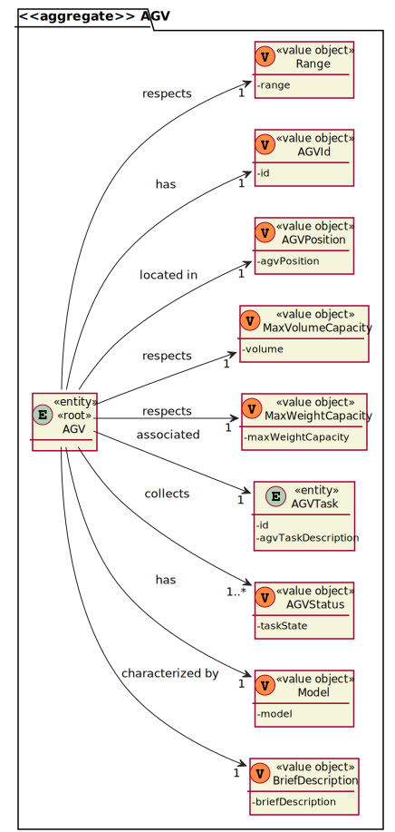

# US2005 - Como Funcionário do Armazém, quero abrir um painel web apresentando o status atual dos AGVs, bem como sua posição no layout do armazém e atualizado automaticamente (por exemplo: a cada minuto).
=======================================

# 1. Requisitos

**US2005** Como {Funcíonario do aramazém} pretendo...

- US2005.1- abrir uma página web com o status e as posições dos AGVs.

### 1.1 Especificações e esclarecimentos do cliente

> [Question:](https://moodle.isep.ipp.pt/mod/forum/discuss.php?d=16277)
> Dear Client,
> Question 1:It is mentioned that the warehouse is able to force a certain task to a certain AGV, but can this only happen when the AGV is free, or can the warehouse employee cancel a task and assign a new one.
> 
> Question 2:Despite in the provided sprint user stories asking for the digital twin in a web dashboard along with its status and position, in user stories of the next sprint it is said that the development of the movement of the AGV is needed which causes a minor confusion. My question is in this sprint is it required to create the movement of the AGV?
> 
> Question 3:How would you like the dashboard to look? A simple list of the AGVS along with its position and status?
> 
> Best Regards
> 
> [Awnser:](https://moodle.isep.ipp.pt/mod/forum/discuss.php?d=16277)
> Answers:
> Q1: In the scope of US 2003, the AGV is selected by the warehouse employee from the ones that are available and are able to perform the task. Tasks cannot be manually cancelled.
>
> Q2: On Sprint C, the web dashboard needs to be thought and ready to show the current AGVs position, which is read from some where. Further, on sprint D, when simulating the AGV movement the AGV position will change and, therefore, we will be able to see the AGVs position changing accordingly on the web dashboard.
>
> Notice that, this is an integrative project developed following an iterative and incremental process. So, at the end, the pieces need to fit well together.
>
> Q3: No! Preferably, the dashboard should be an approximation to what is depicted on Figure 8 of the specifications document.

> [Question:](https://moodle.isep.ipp.pt/mod/forum/discuss.php?d=16700)
>Dear client,
>Regarding this US it is said that "It must be used the provided application protocol (SPOMS2022). The dashboard is intended to be displayed on a web page provided by an existing HTTP server in the ""BackOfficeApp"" application (...)".
> 
>Our question is, between what applications should the SPOMS protocol be implemented? Should the HTTP server be part of the "BackOfficeApp" and communicate with the AGV Manager using the REQUESTS_API? Or should the HTTP server be its own application and communicate only with the "BackOfficeApp", which on the other hand communicates directly with the database?
> 
>Best Regards,
> 
>G03 2DC
>
> [Awnser:](https://moodle.isep.ipp.pt/mod/forum/discuss.php?d=16700)
>As it is being said the "HTTP Server" is part of the "Backoffice Application" in order to provide a local web page only. As so, the "HTTP Server" is a component of the "Backoffice Application".
>
>However, a question stands out: where the data to be presented by the "HTTP server" comes from?
>
>The "backoffice Application" (or one of its components) must, somehow, get the data from the "AGV Manager" (and/or the system database).
>
>In addition, you should notice that the SPOMS2002 protocol relies on the TCP and not on HTTP.
>
>There is nothing wrong here.
>
>If you still having doubts, I advice you to talk with technical support (in this case, preferably RCOMP lab teachers).

# 2. Análise

- Após a análise da US concluiu-se que não existiam quaisqueres dependências para outras funcionalidades das US's.

## Exerto do modelo de domínio

# 3. Design

- Para o dsenvolvimento dessa US foram aplicados os padrões de 'design' DDD (Domain Drive Design).

## 3.1. Realização da Funcionalidade

### Diagrama de sequência do sistema

### Diagrama de sequência 

## 3.2. Diagrama de Classes

## 3.3. Padrões Aplicados

- Controller - ["A utilização do padrão Controller traz como benefício o isolamento das regras de negócios da lógica de apresentação, que é a interface com o usuário. Isto possibilita a existência de várias interfaces com o usuário que podem ser modificadas sem a necessidade de alterar as regras de negócios, proporcionando muito mais flexibilidade e oportunidades de reuso das classes."](https://www.devmedia.com.br/introducao-ao-padrao-mvc/29308#MVC)

- Creator - ["A criação de objetos é uma das mais comuns atividades em um sistema orientado a objetos. Descobrir qual classe é responsável por criar objetos é uma propriedade fundamental da relação entre objetos de classes particulares."](https://pt.wikipedia.org/wiki/GRASP_(padr%C3%A3o_orientado_a_objetos)#Creator_(criador))

- Repository - ["É uma forma de abstrair a persistência de dados. Ele deixa o mecanismo de como os dados são acessados isolados das regras de negócio. Não é a entidade e não é a conexão que faz a persistência, é o repositório, que é uma classe independente com as responsabilidades desacopladas."](https://pt.stackoverflow.com/questions/101692/como-funciona-o-padr%C3%A3o-repository)

- Factory - ["É um padrão de projeto de software (design pattern, em inglês) que permite às classes delegar para subclasses decidirem, isso é feito através da criação de objetos que chamam o método fabrica especificado numa interface e implementado por um classe filha ou implementado numa classe abstrata e opcionalmente sobrescrito por classes derivadas."](https://pt.wikipedia.org/wiki/Factory_Method)

- Persistence Context

## 3.4. Testes

### Description 

**Teste 1:** Verificar que não é possível criar uma instância da classe Description com valores nulos.

	@Test(expected = IllegalArgumentException.class)
    public void ensureDescriptionIsNotNull() {
        new Description(null);
    }

**Teste 2:** Verificar que não é possível criar uma instância da classe Description se o tamanho da String extrapolar o limite imposto pelo domínio do negócio.

    @Test(expected = IllegalArgumentException.class)
    public void ensureDescriptionLenghtIsBiggerThen20Chars() {
        new Description("ajhsyetgduehgsteg");
    }

    @Test(expected = IllegalArgumentException.class)
    public void ensureDescriptionLenghtHaveNotMoreThen50Chars() {
        new Description("ajhsyetgduehgstegjhfigfrrdkdjhuiygfjeryguygyfreyuerjgehgg");
    }

### Super Category

**Teste 1:** Verificar que não é possível criar uma instância da classe SuperCategory com valores nulos.

	 @Test(expected = IllegalArgumentException.class)
    public void ensureSuperCategoryIsNotNull() {
        new SuperCategory(null);
    }

### Alphanumeric Code

**Teste 1:** Verificar que não é possível criar uma instância da classe AlphanumericCode se a String inserida não for alfanumérica
    
    @Test(expected = IllegalArgumentException.class)
    public void ensureAlphanumericCodeMustBeAlphanumeric() {
        new AlphanumericCode("111111111");
    }
    
    @Test(expected = IllegalArgumentException.class)
    public void ensureAlphanumericCodeMustBeAlphanumeric2() {
        new AlphanumericCode("aaaaaaaaa");
    }

**Teste 2:** Verificar que não é possível criar uma instância da classe Alphanumericcode se o tamanho da String extrapolar o limite imposto pelo domínio do negócio.
    
    @Test(expected = IllegalArgumentException.class)
    public void ensureAlphanumericCodeMustHaveRightLenght() {
        new AlphanumericCode("1jahyeui3hsgte");
    }

### Category 

**Teste 1:** Verificar que só é possível criar uma Categoria caso todos os seus 'Value Objects' cumpram as regras de negócio estabelecidas.

    @Test
    public void ensureThatAllFieldsNeddToRespectBusinessRules() {
        assertNotNull(new CategoryFactory()
                .withAlphanumericaCode(ALPHANUMERIC_CODE)
                .withDescription(CATEGORY_DESCRIPTION)
                .withSuperCategory(SUPER_CATEGORY)
                .build());
    }

# 4. Implementação

- Conforme o ‘design’ feito e com o agregado em questão apara o desenvolvimento desse caso de uso, os sequintes excertos de código abaixo servem para confirmar a veracidade do 'design' proposto.

### Description

    /**
    * Value Object that will represent the description of a category.
    * 
    * Created by Manuela Leite on 27/04/2022.
    */

    @Embeddable
    public class Description implements ValueObject, Serializable, Comparable<Description> {

        private final String description;
    
        public Description(String description) {
            Preconditions.nonEmpty(description, "The description of a category cannot be empty!");
            Preconditions.noneNull(description, "The description of a category cannot be null!");
            Preconditions.ensure(StringPredicates.isPhrase(description), "Invalid description format!");
    
            if (description.length() < 20 || description.length() > 50)
                throw new IllegalArgumentException("The description is not the size allowed!");
    
            this.description = description;
        }
    
        protected Description(){
            this.description = "";
        }
    
        @Override
        public String toString() {
            return description;
        }
    
        public static Description valueOf(final String description) {
            return new Description(description);
        }
    
        @Override
        public boolean equals(Object o) {
            if (this == o) return true;
            if (!(o instanceof Description)) return false;
            Description that = (Description) o;
            return Objects.equals(description, that.description);
        }
    
        @Override
        public int hashCode() {
            return new HashCoder().with(this.description).code();
        }
    
        @Override
        public int compareTo(Description o) {
            return description.compareTo(o.description);
        }
    }

### Category 
    
    /**
    * Entity Root that will represent a Category.
    *
    * Created by Manuela Leite on 27/04/2022.
    */

    @Entity
        public class Category implements AggregateRoot<Long>, Serializable {

        private static final long serialVersionUID = 1L;
    
        @Version
        private Long version;
    
        @Id
        @GeneratedValue(strategy= GenerationType.AUTO)
        private Long categoryId;
    
        @Column
        private AlphanumericCode alphanumericCode;
    
        @Column
        private Description description;
    
        @Column
        private SuperCategory superCategory;
    
    
        public Category(AlphanumericCode alphanumericCode, Description description, SuperCategory superCategory) {
            this.alphanumericCode = alphanumericCode;
            this.description = description;
            this.superCategory = superCategory;
        }
    
        protected Category(){
    
        }
    
        @Override
        public boolean sameAs(Object other) {
            return DomainEntities.areEqual(this, other);
        }
    
        @Override
        public int compareTo(Long other) {
            return AggregateRoot.super.compareTo(other);
        }
    
        @Override
        public Long identity() {
            return this.categoryId;
        }
    
        @Override
        public boolean hasIdentity(Long id) {
            return AggregateRoot.super.hasIdentity(id);
        }
    
        @Override
        public boolean equals(Object o) {
           return DomainEntities.areEqual(this, o);
        }
    
        @Override
        public int hashCode() {
            return DomainEntities.hashCode(this);
        }
    }

# 5. Integração/Demonstração

* Como este caso de uso não possui depêndencias a única integração a qual tivemos de nos preocupar foi com a sua persistência na base de dados.
