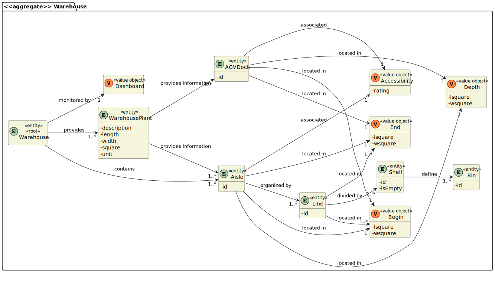
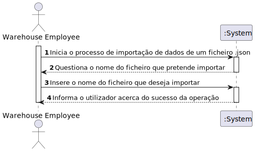
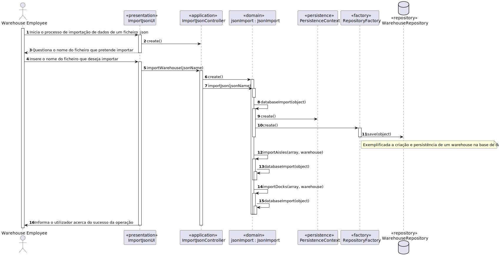
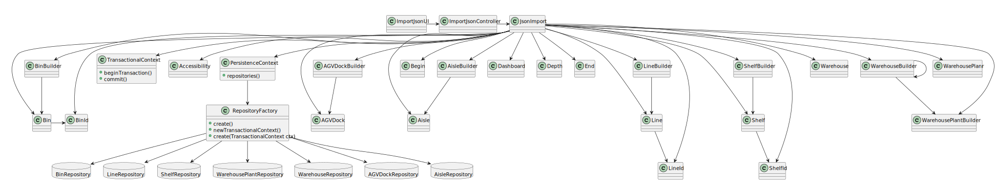

US2001 - As Warehouse Employee, I want to set up the warehouse plant by uploading a JSON file.
=======================================

# 1. Requisitos

**As a Warehouse Employee, I want to set up the warehouse plant by uploading a JSON file.**

### 1.1 Especificações comunicadas pelo cliente

> [Questão](https://moodle.isep.ipp.pt/mod/forum/discuss.php?d=15995#p20587): 
> Dear Client, Regarding US2001, should the warehouse employee select from a list the warehouse he wants to set up the plant or should he type, for example, the id of the warehouse he wants to set up the plant?
>> **Resposta**: Within this prototype, for the sake of simplicity, there is only 1 (one) warehouse. Best regards.

> [Questão](https://moodle.isep.ipp.pt/mod/forum/discuss.php?d=15781#p20356):
Dear client, Regarding the upload of a JSON file, is that file supposed to be stored with the rest of the application and be uploaded every time the 
application runs or should the upload be done only once where the information would all be uploaded to the application database and the JSON file discarded/not stored?
>> **Resposta**: The purpose of uploading a JSON file (US2001) is to set up the warehouse plant information required to the system work properly.\
Once that information is set up, there is no need to repeat the setup process. As so, if a JSON file is found the user might be prompt if (s)he wants to update the information about the warehouse plant. The user might also update the information by re-executing the US2001.\
Yet, it is worth noticing that the JSON file might not be available on all workstations used by warehouse employees.\
As so, persisting warehouse plant data on the database seems to be a good option.

> [Questão](https://moodle.isep.ipp.pt/mod/forum/discuss.php?d=15758#p20257):
Dear client,\Regarding the shelves in each row that are part of an aisle, is there a need to differentiate them? If not, how will the AGV know on which shelf to look for a product? Because, as we understood, different products can be placed on a different shelf of the same row, and according to the JSON file provided, each row only states how many shelves it has.\
Our best regards.
>> **Resposta**: Yes! You need to differentiate the shelves in each row of an aisle.\
Recall that "The products’ location in the warehouse, which corresponds to a storage area i.e., the aisle identifier, the row identifier, and the shelf identifier. All these identifiers are numeric."\
As you have noticed, each row states how many shelves it has. As so, if a row states it has 4 shelves, it means that the row shelves are identified as shelf 1, 2, 3 and 4 from the bottom to the top.\
If another row stated it has 3 shelves, it means that such row shelves are identified as shelf 1, 2 and 3 again from the bottom to the top.\
I hope this clarifies your doubt.
 
 
> [Questão](https://moodle.isep.ipp.pt/mod/forum/discuss.php?d=15725#p20229):
Dear Client,\
Does a warehouse always have the same plant or can it have different plants in the future?\
>> **Resposta**: Each warehouse has its own plant and, therefore, plants might vary from one warehouse to another.\
However, any warehouse plant is described by a JSON file according to the data structure described in section 5.2 of the specifications' document.\
On US2001, any JSON file meeting such data structure must be supported. 

# 2. Análise

### Domain Model Excerpt

### System Sequence Diagram

# 3. Design

- Nesta secção é descrito e demonstrado o design adotado para satisfazer a funcionalidade requisitada.

## 3.1. Realização da Funcionalidade

### Sequence Diagram

## 3.2. Diagrama de Classes

### Class Diagram

## 3.3. Padrões Aplicados

*Nesta secção deve apresentar e explicar quais e como foram os padrões de design aplicados e as melhores práticas.*

## 3.4. Testes
*Nesta secção deve sistematizar como os testes foram concebidos para permitir uma correta aferição da satisfação dos requisitos.*

**Teste 1:** Verificar que não é possível criar uma instância da classe Exemplo com valores nulos.

	@Test(expected = IllegalArgumentException.class)
		public void ensureNullIsNotAllowed() {
		Exemplo instance = new Exemplo(null, null);
	}

# 4. Implementação

*Nesta secção a equipa deve providenciar, se necessário, algumas evidências de que a implementação está em conformidade com o design efetuado. Para além disso, deve mencionar/descrever a existência de outros ficheiros (e.g. de configuração) relevantes e destacar commits relevantes;*

*Recomenda-se que organize este conteúdo por subsecções.*

# 5. Integração/Demonstração

*Nesta secção a equipa deve descrever os esforços realizados no sentido de integrar a funcionalidade desenvolvida com as restantes funcionalidades do sistema.*

# 6. Observações

*Nesta secção sugere-se que a equipa apresente uma perspetiva critica sobre o trabalho desenvolvido apontando, por exemplo, outras alternativas e ou trabalhos futuros relacionados.*

