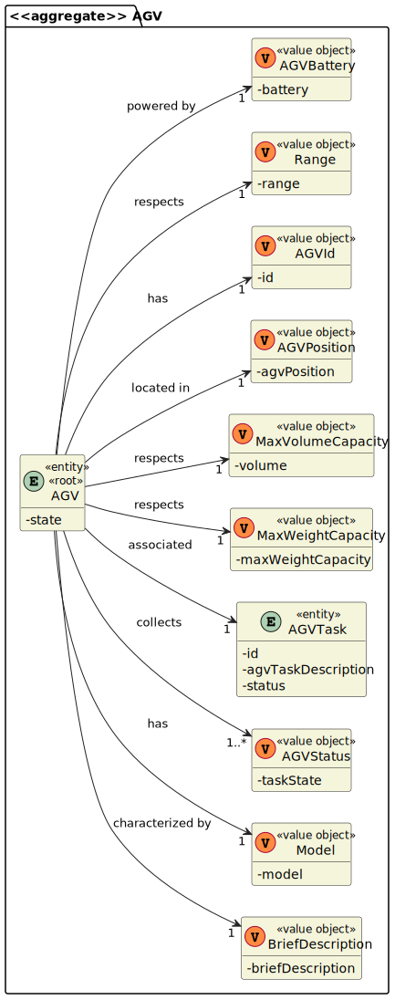

US5100 - Como Gerente de Projeto, quero que a equipa desenvolva e integre os demais componentes/partes do gêmeo digital AGV (ex.: movimento, sensores de obstáculos, unidade de controle).
=======================================

# 1. Requisitos

**US5502** Como {Gerente de Projeto} pretendo...

- US5002.1- que a equipa desenvolva e integre os demais componentes/partes do gémeo digital AGV (ex.: movimento, sensores de obstáculos, unidade de controle).

**Critérios de Aceitação**:

- Uso dos conhecimentos adquiridos no âmbito da unidade curricular de SCOMP, mais especificamente o uso de Threads para integração dos vários módulos que compôem o AGV Twin.

### 1.1 Especificações comunicadas pelo cliente

> [Question:](https://moodle.isep.ipp.pt/mod/forum/discuss.php?d=16593#p21287)
>Dear Client,
>I have a question about the input and output communication between the AGV DIgital Twin and the AGV Manager.
>Q: What type of communication do you want, i.e., what are the communications that you want to have between these two. Like AGV Manager says "Take a product" and AGV Digital Twin says "Taken"? Is it something like that? Or am i confused?
> 
> [Awnser:](https://moodle.isep.ipp.pt/mod/forum/discuss.php?d=16593#p21287)
> The communication must follow the SPOMS2022 protocol.
>It is up to you and your team to devise a set of messages fulfilling the business requirements properly.

> [Question:](https://moodle.isep.ipp.pt/mod/forum/discuss.php?d=16437)
>Dear Client
>Regarding the USs 1901,4001, 5001, and 5002, what would you consider its complete state, that is, what would be the criterion to define whether or not this US is functional?
>
> [Awnser:](https://moodle.isep.ipp.pt/mod/forum/discuss.php?d=16437)
> For all of those US, the communication between the two involved components must be implemented in accordance with the SPOMS2022. The requests processing can be somehow mocked. For instance, if processing a request implies saving some data to the database, the component can instead write such data to a log (mocking). Latter, on next sprint, the teams implement the interaction to the database.
>However, it is not advisable mocking everything, namely the components (internal) state. Notice that by mocking you are letting extra effort to the next sprint.
>Finally, all US must be demonstrable.

# 2. Análise

### Exerto do modelo de domínio

# 3. Design

## 3.1. Realização da Funcionalidade

### Diagrama de sequência do sistema

# 4. Implementação

## Control System 

## Sensors 

## Route Planner 

## Battery Manager System

### Requisitos 

O sistema de bateria é responsável pela monitorização da bateria do AGV.

### Implementação

A implementação do sistema de bateria do AGV foi realizada na Classe 'MoveAGV'.

    public class MoveAGV extends Thread {

        private final AGV agv;
        private static final int ACCEPTED_LEVEL_BATTERY = 25;

    }

O racíocinio implementado para a realização dessa funcionalidade foi o seguinte:

- A cada movimento realizado pelo AGV este perderá 1% da sua bateria.

        private void updateAGV(final Coordinate path) {
            agv.updateAGVPosition(path.getRow() + "," + path.getCol());
            agv.getBattery().decresyBatteryLevel(1);
            updateDatabase(); 
        }

- Quando o nível de bateria do AGV estiver abaixo do nível aceitável, este retornará a sua 'AGV Dock' para recarregar.

        if (!checkBaterry()){
                int coordinateX = agv.getAgvDock().getBegin().getBeginLSquare();
                int coordinateY = agv.getAgvDock().getBegin().getBeginWSquare();

                coordinate = WarehouseMovement.minDistance(whMovement.getGrid(), x, y, coordinateX, coordinateY);
                pathList = WarehouseMovement.backTrackPath(coordinate);

                for (var path1 : pathList){
                    array = agv.getPosition().getAgvPosition().split(",");
                    x = Integer.parseInt(array[0]);
                    y = Integer.parseInt(array[1]);

                    updateGrid(path1, x, y);

                    updateAGV(path1);

                    speed = getAction();
                    changeSpeed(control/1000);
                    whMovement.printMatrix();
                }
                changeAGVStatus();
                chargeAGV();

                break;
        }

### Justificação das decisões tomadas

- Optou-se por realizar a funcionalidade da bateria na classe 'MoveAGV', pois, como está é a classe responsável pelos movimentos do AGV foi de mais fácil integração.

- Após um debate entre os membros do grupo, decidimos que não havia necessidade da criação de outra Thread que seria somente responsável por carregar o AGV. 

## Positioning

### Requisitos

O sistema de Posicionamento é responsável por atualizar a posição do AGV e calcular a sua velocidade.

### Implementação

A implementação do sistema de posicionamneto do AGV foi realizada na Classe 'MoveAGV'.

    public class MoveAGV extends Thread {

        private final AGV agv;
        private int x;
        private int y;

    }

O racíocinio implementado para a realização dessa funcionalidade foi o seguinte:

- Será calculada a rota para que o AGV mova-se de uma posição a outra

        private void moveAGV(final int desiredX, final int desiredY) {
            var array = agv.getPosition().getAgvPosition().split(",");
            var x = Integer.parseInt(array[0]);
            var y = Integer.parseInt(array[1]);
            var coordinate = WarehouseMovement.minDistance(whMovement.getGrid(), x, y, desiredX, desiredY);  
        }

- Sempre que houver o movimento de uma posição para outra, a Thread responsável pela movimentação do AGV irá adormecer, ou seja, a velocidade a qual o AGV irá andar será o tempo que dorme pela quantidade de quadrados que anda

        speed = getAction();
        changeSpeed(speed/1000);

        if(speed != -1) {
            try {
                sleep(speed);
            } catch (InterruptedException e) {
                System.out.println("There was a problem regulating the AGV speed.");
            }
        } else{
            moveAGV(desiredX, desiredY);
            break;
        }

- A medida que o AGV realiza a sua rota, a sua posição será automaticamente atualizada na base de dados

        private void updateAGV(final Coordinate path) {
            agv.updateAGVPosition(path.getRow() + "," + path.getCol());
            agv.getBattery().decresyBatteryLevel(1);
            updateDatabase();
        }

### Justificação das decisões tomadas

- Optou-se por realizar a funcionalidade do posicionamneto na classe 'MoveAGV', pois, está é a classe responsável pelos movimentos do AGV.

# 5. Integração/Demonstração

# 6. Observações

#### Nota: A funcionalidade requisitada pela US5100 foi dividida em diversas componentes devido à extensão da mesma. 

A divisão das componentes entre os membros do grupo foi feita da seguinte forma:

- Manuela Leite (1200720) - BMS e Positioning
- Francisco Redol (1201239) - Control System e Sensors 
- Pedro Rocha (1201382) - Simulation engine
- Rita Ariana (1201386) - Route Planner 
