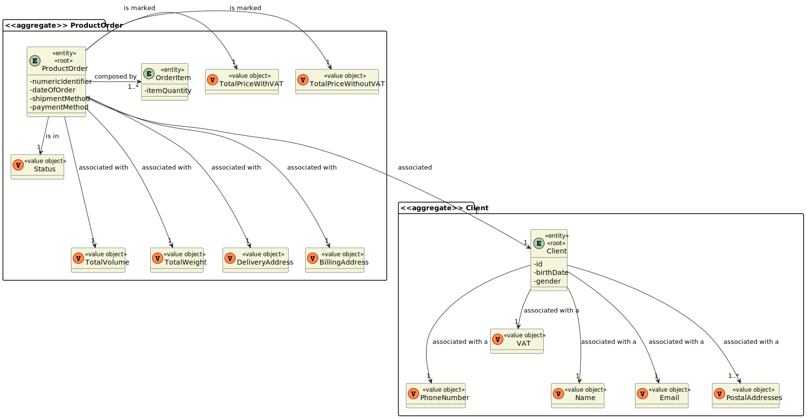
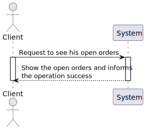
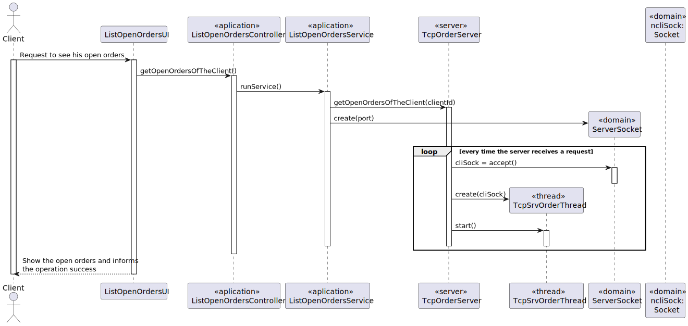
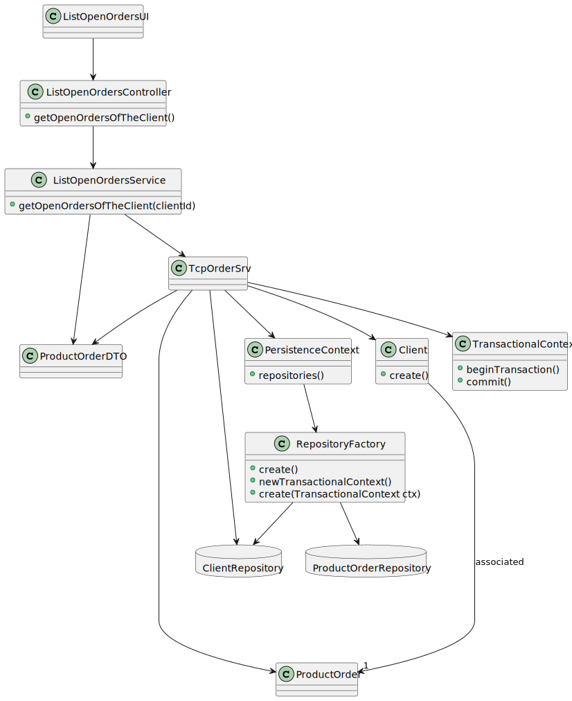

# US1502 - Como Cliente, quero ver/verificar o estado das minhas encomendas em aberto.
=======================================

# 1. Requisitos

**US1502** Como {Cliente} pretendo...

- US1502.1- Acessar a lista de pedidos que já realizei.

A interpretação feita deste requisito foi a seguinte:

Como sou um Cliente, ou seja, um ator do sistema, precisso acessar ao sistema para visualizar que pedidos já realizei.

### 1.1 Especificações e esclarecimentos do cliente

> [Question:]()
> 
> [Awnser:]()

# 2. Análise

- Após a análise da US, concluiu-se que este caso de uso depende da US1901 visto que é obrigatório a utilização da componente 'OrderServer'.

# 2.1.  Fluxo de Troca de Mensagens

1. **Espera** pela mensagem do **Cliente** com o **Código COMMTEST (0)**.
2. **Manda** ao **Cliente** o **Código ACK (2)**.
3. **Espera** pela mensagem do **Cliente** com a informação que precisa obter.
4. **Envia** as informações pedidas ao **Cliente**.
5. **Espera** pela mensagem do **Cliente** com o **Código de Fim (1)**.
6. **Manda** ao **Cliente** o **Código de Entendido (2)**.
7. **Fecha** o Socket.

* (**NOTA**: Caso exista algum problema durante a troca de mensagens o **socket é fechado**)

| Código | Request                                   |
|--------|-------------------------------------------|
| 6      | Obter as encomendas associadas ao cliente |

## Exerto do modelo de domínio

# 3. Design

- Para o desenvolvimento dessa US foram aplicados os padrões de 'design' DDD (Domain Drive Design).

## 3.1. Realização da Funcionalidade

### Diagrama de sequência do sistema

### Diagrama de sequência

## 3.2. Diagrama de Classes

## 3.3. Padrões Aplicados

- Creator - ["A criação de objetos é uma das mais comuns atividades em um sistema orientado a objetos. Descobrir qual classe é responsável por criar objetos é uma propriedade fundamental da relação entre objetos de classes particulares."](https://pt.wikipedia.org/wiki/GRASP_(padr%C3%A3o_orientado_a_objetos)#Creator_(criador))

- Controller - ["A utilização do padrão Controller traz como benefício o isolamento das regras de negócios da lógica de apresentação, que é a interface com o usuário. Isto possibilita a existência de várias interfaces com o usuário que podem ser modificadas sem a necessidade de alterar as regras de negócios, proporcionando muito mais flexibilidade e oportunidades de reuso das classes."](https://www.devmedia.com.br/introducao-ao-padrao-mvc/29308#MVC)

- Repository - ["É uma forma de abstrair a persistência de dados. Ele deixa o mecanismo de como os dados são acessados isolados das regras de negócio. Não é a entidade e não é a conexão que faz a persistência, é o repositório, que é uma classe independente com as responsabilidades desacopladas."](https://pt.stackoverflow.com/questions/101692/como-funciona-o-padr%C3%A3o-repository)

- Factory - ["É um padrão de projeto de software (design pattern, em inglês) que permite às classes delegar para subclasses decidirem, isso é feito através da criação de objetos que chamam o método fabrica especificado numa interface e implementado por um classe filha ou implementado numa classe abstrata e opcionalmente sobrescrito por classes derivadas."](https://pt.wikipedia.org/wiki/Factory_Method)

- Persistence Context

## 3.4. Testes

**Teste 1 :** Verifica que se o volume total de uma encomenda extrapolar o limite suportado pelo AGV a encomenda não é atribuida a esse AGV.

    @Test
    void tryToAddOrdersUntilExtrapolatingTheAGVVolumeLimit() {

        AGV agv = buildAGV();

        agv.assignATaskForAGV(new AGVTask("Description"));

        Client client = buildClient();

        Product p = createProduct(5, 100);
        Product p1 = createProduct(50, 10000);
        Product p2 = createProduct(47, 10000);

        List<Product> products = new ArrayList<>();
        products.add(p);
        products.add(p1);
        products.add(p2);

        List<OrderItem> productOrders = transformProduct(products);

        ProductOrder productOrder = buildProductOrder(client, productOrders);

        boolean result = agv.addOrdersToATask("Description", productOrder);

        assertFalse(result);
    }

**Teste 2:** Verifica que se o volume total de uma encomenda for suportado pelo AGV a encomenda é atribuida a esse AGV.

    @Test
    void tryToAddOrdersUntilTheAGVVolumeLimit() {

        AGV agv = buildAGV();

        agv.assignATaskForAGV(new AGVTask("Description"));

        Client client = buildClient();

        Product p = createProduct(5, 200);
        Product p1 = createProduct(50, 200);
        Product p2 = createProduct(47, 200);

        List<Product> products = new ArrayList<>();
        products.add(p);
        products.add(p1);
        products.add(p2);

        List<OrderItem> productOrders = transformProduct(products);

        ProductOrder productOrder = buildProductOrder(client, productOrders);

        boolean result = agv.addOrdersToATask("Description", productOrder);

        assertTrue(result);
    }

**Teste 3:** Verifica que se o peso total de uma encomenda extrapolar o limite suportado pelo AGV a encomenda não é atribuida a esse AGV.

    @Test
    void tryToAddOrdersUntilExtrapolatingTheAGVWeightLimit() {

        AGV agv = buildAGV();

        agv.assignATaskForAGV(new AGVTask("Description"));

        Client client = buildClient();

        Product p = createProduct(200, 5);
        Product p1 = createProduct(100, 5);
        Product p2 = createProduct(150, 5);

        List<Product> products = new ArrayList<>();
        products.add(p);
        products.add(p1);
        products.add(p2);

        List<OrderItem> productOrders = transformProduct(products);

        ProductOrder productOrder = buildProductOrder(client, productOrders);

        boolean result = agv.addOrdersToATask("Description", productOrder);

        assertFalse(result);
    }

**Teste 4:** Verifica que se o peso total de uma encomenda for suportado pelo AGV a encomenda é atribuida a esse AGV.

    @Test
    void tryToAddOrdersUntilTheAGVWeightLimit() {

        AGV agv = buildAGV();

        agv.assignATaskForAGV(new AGVTask("Description"));

        Client client = buildClient();

        Product p = createProduct(100, 5);
        Product p1 = createProduct(100, 5);
        Product p2 = createProduct(100, 5);

        List<Product> products = new ArrayList<>();
        products.add(p);
        products.add(p1);
        products.add(p2);

        List<OrderItem> productOrders = transformProduct(products);

        ProductOrder productOrder = buildProductOrder(client, productOrders);

        boolean result = agv.addOrdersToATask("Description", productOrder);

        assertTrue(result);
    }

# 4. Implementação

- Conforme o ‘design’ feito e com o agregado em questão apara o desenvolvimento desse caso de uso, os sequintes excertos de código abaixo servem para confirmar a veracidade do 'design' proposto.

### TcpOrderSrv

    package eapli.base.orderServer.tcp;
    
    import eapli.base.MessageUtils;
    import eapli.base.clientmanagement.domain.Client;
    import eapli.base.clientmanagement.domain.Email;
    import eapli.base.clientmanagement.repositories.ClientRepository;
    import eapli.base.infrastructure.persistence.PersistenceContext;
    import eapli.base.orderServer.tcp.utils.ConstantsServer;
    import eapli.base.ordermanagement.domain.ProductOrder;
    import eapli.base.ordermanagement.repository.OrderRepository;
    import eapli.base.productmanagement.application.ListProductDTOService;
    import eapli.base.productmanagement.domain.Product;
    import eapli.base.productmanagement.domain.UniqueInternalCode;
    import eapli.base.productmanagement.dto.ProductDTO;
    import eapli.base.productmanagement.repository.ProductRepository;
    import eapli.base.shoppingcarmanagement.domain.ShopCarItem;
    import eapli.base.shoppingcarmanagement.domain.ShoppingCar;
    
    import eapli.base.shoppingcarmanagement.repository.ShoppingCarRepository;
    
    import java.io.*;
    import java.net.*;
    import java.util.Optional;
    
    import static eapli.base.MessageUtils.writeMessage;
    
    
    
    public class TcpOrderSrv {
    static ServerSocket sock;
    
        public static void main(String args[]) throws Exception {
            Socket cliSock;
    
            try { sock = new ServerSocket(10001); }
            catch(IOException ex) {
                System.out.println("Failed to open server socket");
                System.exit(1);
            }
    
            while(true) {
                cliSock=sock.accept();
                new Thread(new TcpSrvOrderThread(cliSock)).start();
            }
        }
    }
    
    
    
    class TcpSrvOrderThread implements Runnable {
    private Socket s;
    
        private final ListProductDTOService service = new ListProductDTOService();
        private final ProductRepository productRepository = PersistenceContext.repositories().products();
        private final ClientRepository clientRepository = PersistenceContext.repositories().client();
        private final ShoppingCarRepository shoppingCarRepository = PersistenceContext.repositories().shoppingCar();
        private final OrderRepository orderRepository = PersistenceContext.repositories().orders();
        private Product product;
        private Optional<Client> client;
        private Optional<ShoppingCar> shoppingCar;
    
        public TcpSrvOrderThread(Socket cli_s) {
            s = cli_s;
        }
    
        public void run() {
            InetAddress clientIP;
    
            try {
    
                clientIP = this.s.getInetAddress();
                System.out.println("[INFO] Nova conexão de cliente: " + clientIP.getHostAddress() + ", porta: " + this.s.getPort() + ".");
    
                DataInputStream sIn = new DataInputStream(this.s.getInputStream());
                DataOutputStream sOut = new DataOutputStream(this.s.getOutputStream());
    
                byte[] clientMessage = sIn.readNBytes(4);
    
                if (clientMessage[1] == ConstantsServer.START_CODE) {
                    System.out.println("[SUCCESS] Código de Teste (0) do Cliente recebido.");
    
                    MessageUtils.writeMessage((byte) 2,sOut);
                    System.out.println("[INFO] A Mandar Código de Entendido (2) ao Cliente.");
    
                    byte[] clientMessageUS = new byte[4];
                    MessageUtils.readMessage(clientMessageUS, sIn);
    
                    /*============Enviar produtos ao cliente============*/
                    if(clientMessageUS[1] == ConstantsServer.SEND_PRODUCTS) {
                        ObjectOutputStream sOutputObject = new ObjectOutputStream(this.s.getOutputStream());
    
                        Iterable<ProductDTO> productCatalog = service.allProducts();
                        sOutputObject.writeObject(productCatalog);
                        sOutputObject.flush();
                    }
    
                    /*============Verificar se Produto Existe============*/
                    if(clientMessageUS[1] == ConstantsServer.PRODUCT_EXISTS) {
                        String productUniqueInternalCode = MessageUtils.getDataFromMessage(clientMessageUS,sIn);
                        product = productRepository.findByUniqueInternalCode(UniqueInternalCode.valueOf(productUniqueInternalCode));
                        if(product == null) {
                            MessageUtils.writeMessageWithData((byte) 3, "[FAILURE] Product not found! Please try again.", sOut);
                        } else {
                            MessageUtils.writeMessageWithData((byte) 3, "[SUCCESS] Product found!", sOut);
                        }
                    }
    
                    /*============Adicionar Produto ao Carrinho de Compras============*/
                    if(clientMessageUS[1] == ConstantsServer.SHOPPINGCAR_ADD) {
                        String info = MessageUtils.getDataFromMessage(clientMessageUS,sIn);
                        String[] array = info.split(" ");
                        String quantidade = array[0];
                        String email = array[1];
                        String productUniqueInternalCode = array[2];
                        product = productRepository.findByUniqueInternalCode(UniqueInternalCode.valueOf(productUniqueInternalCode));
                        client = clientRepository.findByEmail(Email.valueOf(email));
                        ShopCarItem item = new ShopCarItem(Integer.parseInt(quantidade),product);
                        if(client.isPresent()) {
                            shoppingCar = shoppingCarRepository.findByClient(client.get());
                            if(shoppingCar.isPresent()) {
                                shoppingCar.get().addProductToShoppingCar(item);
                                shoppingCarRepository.save(shoppingCar.get());
                            } else {
                                ShoppingCar shoppingCar1 = new ShoppingCar(client.get());
                                shoppingCar1.addProductToShoppingCar(item);
                                shoppingCarRepository.save(shoppingCar1);
                            }
                        }
    
                    }
                    /*============ Buscar encomendas associadas a um cliente ============*/
                    if (clientMessageUS[1] == ConstantsServer.OPEN_ORDERS){
    
                        Long clientId = Long.parseLong(MessageUtils.getDataFromMessage(clientMessageUS,sIn));
                        Iterable<ProductOrder> productOrderList = orderRepository.getOpenOrdersOfAClient(clientId);
                        ObjectOutputStream sOutputObject = new ObjectOutputStream(this.s.getOutputStream());
    
                        sOutputObject.writeObject(productOrderList);
                        sOutputObject.flush();
    
                    }
    
                    byte[] clientMessageEnd = sIn.readNBytes(4);
    
                    if (clientMessageEnd[1] == ConstantsServer.FINISH_CODE) {
                        System.out.println("[SUCCESS] Código de Fim (1) do Cliente recebido.");
                        writeMessage((byte) 2,sOut);
                        System.out.println("[INFO] A Mandar Código de Entendido (2) ao Cliente.");
                        System.out.println("[INFO] Cliente " + clientIP.getHostAddress() + ", porta: " + this.s.getPort() + " desconectado.");
                    } else {
                        System.out.println("[ERROR] Pacote do Cliente invalido.");
                    }
    
                } else {
                    System.out.println("[ERROR] Pacote do Cliente invalido.");
                }
    
            } catch (IOException e) {
                e.printStackTrace();
            } finally {
                try {
                    this.s.close();
                } catch (IOException e) {
                    System.out.println("[ERROR] Problemas a Fechar o Socket.\n\n");
                }
                System.out.println("[SUCCESS] Socket Fechado.\n\n");
            }
    
        }
    
    }

## JpaOrderRepository
    
    package eapli.base.persistence.impl.jpa;
    
    import eapli.base.Application;
    import eapli.base.ordermanagement.domain.OrderStatus;
    import eapli.base.ordermanagement.domain.ProductOrder;
    import eapli.base.ordermanagement.repository.OrderRepository;
    import eapli.framework.domain.repositories.TransactionalContext;
    import eapli.framework.infrastructure.repositories.impl.jpa.JpaAutoTxRepository;
    
    import javax.persistence.TypedQuery;
    
    public class JpaOrderRepository extends JpaAutoTxRepository<ProductOrder, Long, Long>
    implements OrderRepository {
    
    
        public JpaOrderRepository(String puname){
            super(puname, Application.settings().getExtendedPersistenceProperties(),"eapli.base");
        }
    
    
        public JpaOrderRepository(TransactionalContext autoTx, String name) {
            super(autoTx, name);
        }
    
        @Override
        public ProductOrder getOrderById (Long id){
            final TypedQuery<ProductOrder> query = super.createQuery(
                    "SELECT d FROM ProductOrder d WHERE orderid = '" + id + "'",
                    ProductOrder.class);
            return query.getSingleResult();
    
        }
    
    
        @Override
        public Iterable<ProductOrder> getOrdersWhoNeedToBePrepared () {
            final TypedQuery<ProductOrder> query = entityManager().createQuery(
                    "SELECT d FROM ProductOrder d  WHERE d.status = :status",
                    ProductOrder.class);
            query.setParameter("status", new OrderStatus(OrderStatus.Status.TO_BE_PREPARED));
    
            return query.getResultList();
        }
    
        @Override
        public Iterable<ProductOrder> findOrdersDispatchedForCustomerDelivery() {
            final TypedQuery<ProductOrder> query = entityManager().createQuery(
                    "SELECT d FROM ProductOrder d  WHERE d.status = :status",
                    ProductOrder.class);
            query.setParameter("status", new OrderStatus(OrderStatus.Status.DISPATCHED_FOR_COSTUMER));
    
            return query.getResultList();
        }
    
        @Override
        public Iterable<ProductOrder> getOpenOrdersOfAClient(Long clientId) {
            final TypedQuery<ProductOrder> query = entityManager().createQuery(
                    "SELECT d1 FROM ProductOrder d1 WHERE d1.id NOT IN (SELECT d.id FROM ProductOrder d JOIN d.client aind WHERE aind.id = :id AND d.status = :status)",
                    ProductOrder.class);
            query.setParameter("id", clientId);
            query.setParameter("status", OrderStatus.Status.RECEIVED_BY_COSTUMER);
    
            return query.getResultList();
        }
    }
    
# 5. Observações

# 6. Integração/Demonstração

