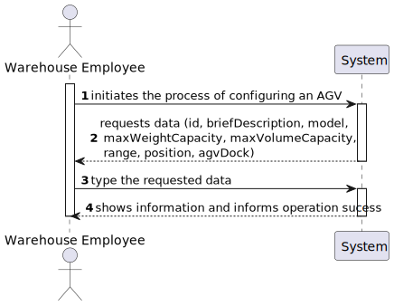

US2002
=======================================

# 1. Requirements

### As a Warehouse Employee, I want to configure the AGV's available in the Warehouse.

## Customer Specifications
>Question: There is a need to each AVG has its own avg dock? If it does makes sence to give him a responsible avg?
> 
>[Awnser:](https://moodle.isep.ipp.pt/mod/forum/discuss.php?d=15824#p20334) Every AGV has a base location, i.e.  an AGV dock. The same AGV dock can not be used by two (or more) distinct AGVs.

>Question: A single AGV dock, no matter how large, can only be the base for one AGV robot.
>
>[Awnser:](https://moodle.isep.ipp.pt/mod/forum/discuss.php?d=15688#p20163) Yes. That is correct.

>Question: What do you understand about configuring the AGV's available on the warehouse. What changes the warehouse employee can do in his specifics and actions/taks?
>
>[Awnser:](https://moodle.isep.ipp.pt/mod/forum/discuss.php?d=15672#p20145) Within this context, "configuring the AGVs available on the warehouse" means that the Warehouse Employee needs to specify which are the AGV operating in the warehouse and, therefore, define some basic information regarding each AGV.
> Please, read carefully the specifications' document to find ou which information is need. An highlight is provided below.
> "The AGVs operating on the warehouse, its characteristics (e.g.: identifier, short description, model, and maximum weight it can carry) and its base location (i.e., the AGV dock). In addition, it is necessary to know the AGV status regarding its autonomy (e.g.: 2 hours left) and current task (e.g.: free, charging, occupied serving a given order)." (cf. Specifications' document)

>Question: Can we conclude that if the AGV does not support the weight required for an Order, it automatically rejects this task?
>
>[Awnser:](https://moodle.isep.ipp.pt/mod/forum/discuss.php?d=15579#p20035) Yes! But, notice that regarding AGV Digital Twin the "automatically" is implemented by your team.

>Question: Should the id be generated automatically?
>
>[Awnser:](https://moodle.isep.ipp.pt/mod/forum/discuss.php?d=15988#p20541) No!

>Question: When we want to configure an agv, should we ask for a list of available agv where we will choose one or will it (automatically) be given one that is available?
>
>[Awnser:](https://moodle.isep.ipp.pt/mod/forum/discuss.php?d=15988#p20541) There is no list of AGV to choose from. The user specifies the AGV that exist in the warehouse. So, the user is creating the list of AGVs.

>Question: How many agvs can the base location of wharehouse have?
>
>[Awnser:](https://moodle.isep.ipp.pt/mod/forum/discuss.php?d=15988#p20541) As said before, 1 AGV per dock.

>Question: When we want to set the agv, does this mean we will create one or will we redefine one that exists and is available (without any task)?
>
>[Awnser:](https://moodle.isep.ipp.pt/mod/forum/discuss.php?d=15988#p20541) I do not understand this question in the scope of US 2002.

>Question: Should the weight, volume, model and capacity of the agv be constant?
>
>[Awnser:](https://moodle.isep.ipp.pt/mod/forum/discuss.php?d=15988#p20541) Such information varies from one AGV to another. Otherwise, it would not make any sense.

>Question: Imagining that we have 5 docs we will have 5 agvs imagining that the 5 are already busy with another task (status: charging, doing a task) is it possible to configure it even being busy (status different from free) or is it only possible to configure the agv when it is with status: free ?
>
>[Awnser:](https://moodle.isep.ipp.pt/mod/forum/discuss.php?d=15988#p20541)  Through US 2002, the system knows which AGVs are operating in the warehouse and the characteristics of each one, including the dock that each AGV has as its base location. Notice that, for instance, despite of existing 5 docks in the warehouse, the number of AGVs operating in the warehouse might be lesser than 5.

>Question: What should the default autonomy when creating an AGV be?
>
>[Awnser:](https://moodle.isep.ipp.pt/mod/forum/discuss.php?d=15961#p20491) There is no default value. The user must type the AGV autonomy in minutes according to the manufacture specifications.

>Question: Should  a list of warehouses be shown for the AGV to be assigned or should the AGV be automatically assigned to the warehouse where the warehouse employee works?
>
>[Awnser:](https://moodle.isep.ipp.pt/mod/forum/discuss.php?d=15961#p20491) As I said before, for now, there is only one warehouse.

>Question: Could you specify the business rules associated with the identifier, short description, and model of the AGVS.
>
>[Awnser:](https://moodle.isep.ipp.pt/mod/forum/discuss.php?d=15961#p20491) You should apply general validation rules such as:
>> identifier: not empty alphanumeric code with at 8 chars maximum;
>
>> short description: not empty having 30 chars maximum;
>
>> model: not empty having 50 chars maximum;
>
> For other necessary attributes, you should follow common-sense.

>Question: Are the current tasks provided(free, charging, occupied serving a given order) fixed, or more could be added?
>
>[Awnser:](https://moodle.isep.ipp.pt/mod/forum/discuss.php?d=15961#p20491) I would not called it task but, instead, AGV status.
> Besides those status I can foresee another status: in maintenance. If you find out more AGV status useful, you might adopt them and further explain/argue about their pertinence.

>Question: Should it be possible to still create an AGV without assigning it to an AGV Dock (in case of none being available)?
>
>[Awnser:](https://moodle.isep.ipp.pt/mod/forum/discuss.php?d=15961#p20491) No! The AGV Dock is mandatory.

>Question: Should it be possible to edit an AGV configuration, or is that outside the scope of US2002?
>
>[Awnser:](https://moodle.isep.ipp.pt/mod/forum/discuss.php?d=15961#p20491)  It outside of scope. But, if you want, you can do it.

## Teacher Clarification
>Clarification: Esclarecimentos adicionais sobre alguns casos de uso
>
>[Awnser:](https://moodle.isep.ipp.pt/mod/forum/discuss.php?d=16072#p20647) A informação contida no ficheiro JSON deve ser utilizada para validar se a docking do AGV existe no caso de uso 2002

# 2. Analysis

### Main success scenario
1. Warehouse Employee requires the configuration of an AGV available in the Warehouse.
2. The System asks for information related to the AGV
3. Warehouse Employee enters the information.
8. The System reports the success of the operation.

### Conditions
The registration information of the new category is persisted/saved in the system.

## 2.1. System Sequence Diagram

## 2.2. Partial Domain Model

# 3. Design

*Nesta secção a equipa deve descrever o design adotado para satisfazer a funcionalidade. Entre outros, a equipa deve apresentar diagrama(s) de realização da funcionalidade, diagrama(s) de classes, identificação de padrões aplicados e quais foram os principais testes especificados para validar a funcionalidade.*

*Para além das secções sugeridas, podem ser incluídas outras.*

## 3.1. Realização da Funcionalidade

*Nesta secção deve apresentar e descrever o fluxo/sequência que permite realizar a funcionalidade.*

## 3.2. Diagrama de Classes

*Nesta secção deve apresentar e descrever as principais classes envolvidas na realização da funcionalidade.*

## 3.3. Padrões Aplicados

*Nesta secção deve apresentar e explicar quais e como foram os padrões de design aplicados e as melhores práticas.*

## 3.4. Testes 
*Nesta secção deve sistematizar como os testes foram concebidos para permitir uma correta aferição da satisfação dos requisitos.*

**Teste 1:** Verificar que não é possível criar uma instância da classe Exemplo com valores nulos.

	@Test(expected = IllegalArgumentException.class)
		public void ensureNullIsNotAllowed() {
		Exemplo instance = new Exemplo(null, null);
	}

# 4. Implementação

*Nesta secção a equipa deve providenciar, se necessário, algumas evidências de que a implementação está em conformidade com o design efetuado. Para além disso, deve mencionar/descrever a existência de outros ficheiros (e.g. de configuração) relevantes e destacar commits relevantes;*

*Recomenda-se que organize este conteúdo por subsecções.*

# 5. Integração/Demonstração

*Nesta secção a equipa deve descrever os esforços realizados no sentido de integrar a funcionalidade desenvolvida com as restantes funcionalidades do sistema.*

# 6. Observações

*Nesta secção sugere-se que a equipa apresente uma perspetiva critica sobre o trabalho desenvolvido apontando, por exemplo, outras alternativas e ou trabalhos futuros relacionados.*

