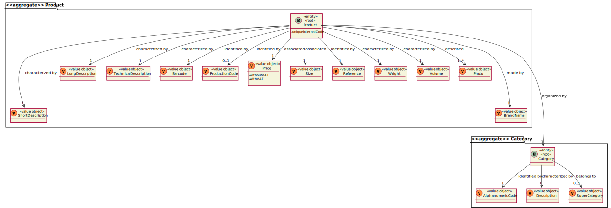

# US1001

# 1. Requisitos
_____
**US1001** As Sales Clerk, I want to specify a new product for sale.

### 1.1 Especificações e esclarecimentos do cliente

> [Question:](https://moodle.isep.ipp.pt/mod/forum/discuss.php?d=15843#p20354)
> Regarding the measures of the product what are the units of measurement that should be supported?
>
> [Awnser:](https://moodle.isep.ipp.pt/mod/forum/discuss.php?d=15843#p20397)
> The width, length and height of a product is specified in millimeters; 
> The weight of the product is specified in grams.

> [Question:](https://moodle.isep.ipp.pt/mod/forum/discuss.php?d=15843#p20354)
  Regarding the barcode of the product should an image be generated or only the code be saved?
>  
> [Awnser:](https://moodle.isep.ipp.pt/mod/forum/discuss.php?d=15843#p20384)
  No image is required to be generated.

# 2. Análise
_____

### 2.1 Excerto do Modelo de Domínio

# 3. Design
_____

### 3.1. Realização da Funcionalidade

### 3.2. Diagrama de Classes

*Nesta secção deve apresentar e descrever as principais classes envolvidas na realização da funcionalidade.*

### 3.3. Padrões Aplicados

*Nesta secção deve apresentar e explicar quais e como foram os padrões de design aplicados e as melhores práticas.*

### 3.4. Testes 

**Teste 1:** Verificar que não é possível criar uma instância da classe Exemplo com valores nulos.

	@Test(expected = IllegalArgumentException.class)
		public void ensureNullIsNotAllowed() {
		Exemplo instance = new Exemplo(null, null);
	}

# 4. Implementação
_____

# 5. Integração/Demonstração
_____

# 6. Observações
_____

