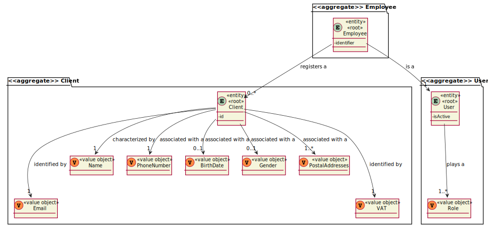

# US1003

# 1. Requisitos

**US1003** As Sales Clerk, I want to register a new customer.

### 1.1 Especificações e esclarecimentos do cliente

> [Question:](https://moodle.isep.ipp.pt/mod/forum/discuss.php?d=15754#p20248)
  Name - should we consider first name, last name or is there anything more worth capturing? Are there length restrictions?
>
> [Answer:](https://moodle.isep.ipp.pt/mod/forum/discuss.php?d=15754#p20258)
  At least a first and last name is required. Although, desirably the customer should specify his/her full name. Considering this, apply the min/max length you consider as reasonable to meet this requirement.

> [Question:](https://moodle.isep.ipp.pt/mod/forum/discuss.php?d=15754#p20248)
  VAT ID - which length should it have? Is it only digits or could there be letters?
>
> [Answer:](https://moodle.isep.ipp.pt/mod/forum/discuss.php?d=15754#p20258)
  VAT ID varies from one country to another. Usually it has letters and numbers (cf. here). The system must be prepared to support/recognize several VAT Ids.

> [Question:](https://moodle.isep.ipp.pt/mod/forum/discuss.php?d=15754#p20248)
  Phone number: which lenght/format?
>
> [Answer:](https://moodle.isep.ipp.pt/mod/forum/discuss.php?d=15754#p20258)
  Phone number: according to international standards (e.g.: +351 934 563 123).

> [Question:](https://moodle.isep.ipp.pt/mod/forum/discuss.php?d=15754#p20248)
  Birthday - in which format?
>
> [Answer:](https://moodle.isep.ipp.pt/mod/forum/discuss.php?d=15754#p20258)
  Birthday: it is a date... you can adopt year/month/day.

> [Question:](https://moodle.isep.ipp.pt/mod/forum/discuss.php?d=15754#p20248)
  Address - What kind of format are we expecting for these? Street name, door number, postal code, city, country is a valid format or are we missing anything?
>
> [Answer:](https://moodle.isep.ipp.pt/mod/forum/discuss.php?d=15754#p20258)
  Address: I think you said it all.

> [Question:](https://moodle.isep.ipp.pt/mod/forum/discuss.php?d=15749#p20243)
When creating a customer, should it be automatically associated with a login, that is, when entering its data, such as name, 
> and so it is necessary to enter a username and a password?
>
> [Answer:](https://moodle.isep.ipp.pt/mod/forum/discuss.php?d=15749#p20255)
A clerk is registering customers either manually or by importing files (cf. Use Case 3.1.4b and 3.1.4c respectively). 
> In this scenario no account activation process is required and/or performed. Moreover, by default, no customer credentials are to be generated. If such credentials are needed, the clerk undergoes on another use case (cf. Use Case 3.1.5).

# 2. Análise

### 2.1 Excerto do Modelo de Domínio

# 3. Design

*Nesta secção a equipa deve descrever o design adotado para satisfazer a funcionalidade. Entre outros, a equipa deve apresentar diagrama(s) de realização da funcionalidade, diagrama(s) de classes, identificação de padrões aplicados e quais foram os principais testes especificados para validar a funcionalidade.*

*Para além das secções sugeridas, podem ser incluídas outras.*

## 3.1. Realização da Funcionalidade

*Nesta secção deve apresentar e descrever o fluxo/sequência que permite realizar a funcionalidade.*

## 3.2. Diagrama de Classes

*Nesta secção deve apresentar e descrever as principais classes envolvidas na realização da funcionalidade.*

## 3.3. Padrões Aplicados

*Nesta secção deve apresentar e explicar quais e como foram os padrões de design aplicados e as melhores práticas.*

## 3.4. Testes 
*Nesta secção deve sistematizar como os testes foram concebidos para permitir uma correta aferição da satisfação dos requisitos.*

**Teste 1:** Verificar que não é possível criar uma instância da classe Exemplo com valores nulos.

	@Test(expected = IllegalArgumentException.class)
		public void ensureNullIsNotAllowed() {
		Exemplo instance = new Exemplo(null, null);
	}

# 4. Implementação

*Nesta secção a equipa deve providenciar, se necessário, algumas evidências de que a implementação está em conformidade com o design efetuado. Para além disso, deve mencionar/descrever a existência de outros ficheiros (e.g. de configuração) relevantes e destacar commits relevantes;*

*Recomenda-se que organize este conteúdo por subsecções.*

# 5. Integração/Demonstração

*Nesta secção a equipa deve descrever os esforços realizados no sentido de integrar a funcionalidade desenvolvida com as restantes funcionalidades do sistema.*

# 6. Observações

*Nesta secção sugere-se que a equipa apresente uma perspetiva critica sobre o trabalho desenvolvido apontando, por exemplo, outras alternativas e ou trabalhos futuros relacionados.*

