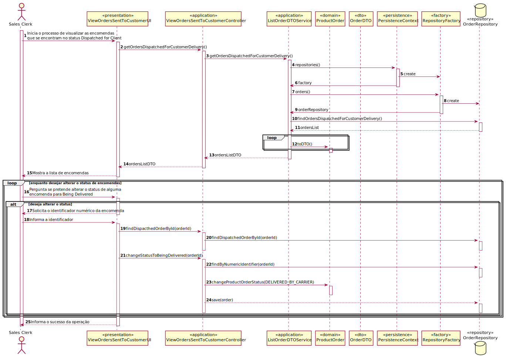

# US1006

# 1. Requisitos

As Sales Clerk, I want to access a list of orders that had been dispatched for customer delivery and be able to update some of those orders to as being delivered.

## 1.1 Especificações e esclarecimentos do cliente

>[Question:](https://moodle.isep.ipp.pt/mod/forum/discuss.php?d=16814#p21556)
The information to present to the Sales Clerk should be different than the information shown to the Warehouse Employee in a similar US or should it have the same information fields?
> 
>[Answer:](https://moodle.isep.ipp.pt/mod/forum/discuss.php?d=16814#p21622)
I would say that some fields might be the same (e.g. order id, date, customer) and differ on others.

# 2. Análise

## 2.1 Excerto do Modelo de Domínio

## 2.2 System Sequence Diagram

## 2.3 Raciocínio

Uma das funcionalidades que esta user story tem que suportar é a visualização das orders
que já se encontram prontas a ser enviadas para o respetivo cliente. As informações que consideramos
mais importantes o sales clerk ter acesso foram o identificador da order, o cliente associado, a data
em que a order foi registada e o respetivo estado.

Caso o sales clerk deseje alterar o estado da order apenas precisa de indicar o identificador da order
mostrado anteriormente.

# 3. Design

## 3.1. Realização da Funcionalidade

## 3.2. Diagrama de Classes

## 3.3. Padrões Aplicados

Foram aplicados os princípios SOLID e os padrões de design de software GoF. 

## 3.4. Testes 

# 4. Implementação

## 4.1 Controller

    public class ViewOrdersSentToCustomerController {

        ListOrderDTOService service = new ListOrderDTOService();
        private final OrderRepository orderRepository = PersistenceContext.repositories().orders();

        public Iterable<OrderDTO> getOrdersDispatchedForCustomerDelivery() {
            return service.getOrdersDispatchedForCustomerDelivery();
        }

        public void changeStatusToBeingDelivered(String orderId) {
            ProductOrder order = orderRepository.getOrderById(Long.parseLong(orderId));
            order.changeProductOrderStatus(new OrderStatus(OrderStatus.Status.DELIVERED_BY_CARRIER));
            orderRepository.save(order);
        }
    }

# 5. Integração/Demonstração

# 6. Observações

