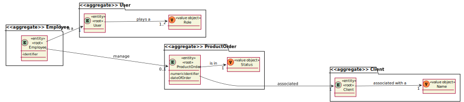
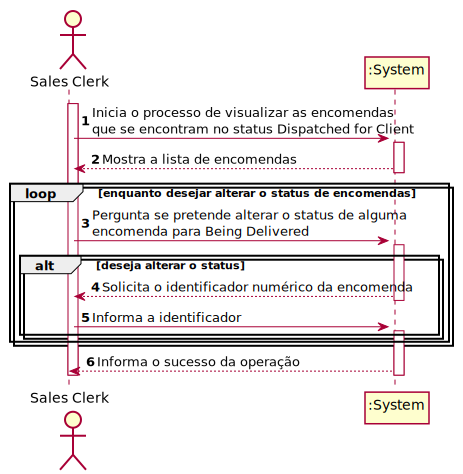

# US1006

# 1. Requisitos

As Sales Clerk, I want to access a list of orders that had been dispatched for customer delivery and be able to update some of those orders to as being delivered.

## 1.1 Especificações e esclarecimentos do cliente

# 2. Análise

## 2.1 Excerto do Modelo de Domínio

## 2.2 System Sequence Diagram

# 3. Design

## 3.1. Realização da Funcionalidade

## 3.2. Diagrama de Classes

## 3.3. Padrões Aplicados

Foram aplicados os princípios SOLID e os padrões de design de software GoF. 

## 3.4. Testes 

# 4. Implementação

# 5. Integração/Demonstração

# 6. Observações

