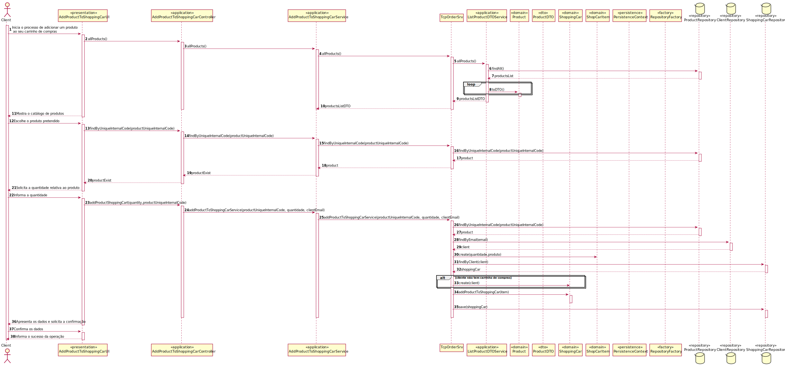

# US1501

# 1. Requisitos

**US1501** As Customer, I want to view/search the product catalog and be able to add a product to the shopping cart.

### 1.1 Especificações e esclarecimentos do cliente

> [Question:](https://moodle.isep.ipp.pt/mod/forum/discuss.php?d=16695#p21422)
We wanted to know which attributes are needed on the shopping cart to show to the user (customer)?
>
> [Answer:](https://moodle.isep.ipp.pt/mod/forum/discuss.php?d=16695#p21451)
> Come on, you must have/acquire autonomy to decide this based on the business description already made.
>
> In addition, you can always put yourself in the role of a customer (and not of a developer) and think a little about what information you, as a customer, would like to see. And that's it, that's the information you have to show.

> [Question:](https://moodle.isep.ipp.pt/mod/forum/discuss.php?d=16611#p21319)
We wanted to ask you if we will need to give the ability to customers to create new users or we just have to stick to the main problem and create a default user for customers at the moment?
>
> [Answer:](https://moodle.isep.ipp.pt/mod/forum/discuss.php?d=16611#p21385)
>US1501 is about a customer view/search the products catalog and add products to the shopping cart.
>
>Each customer is a system user. Customers are created, for instance, in the scope of US 1003.
# 2. Análise

### 2.1 Excerto do Modelo de Domínio

### 2.2 System Sequence Diagram

# 3. Design

## 3.1. Realização da Funcionalidade

## 3.2. Diagrama de Classes

## 3.3. Padrões Aplicados

Foram aplicados os princípios SOLID e os padrões de design de software GoF. 

## 3.4. Testes 

# 4. Implementação

# 5. Integração/Demonstração

Esta User Story tem dependências com a user story 1901.

# 6. Observações

Por motivos de erro ao persistir a informação na base de dados não foi reutilizada a
classe OrderItem e sim criada a classe ShopCarItem.
Esta classe está declarada como agregate root devido a um erro que estava a dar ao persistir a informação.
