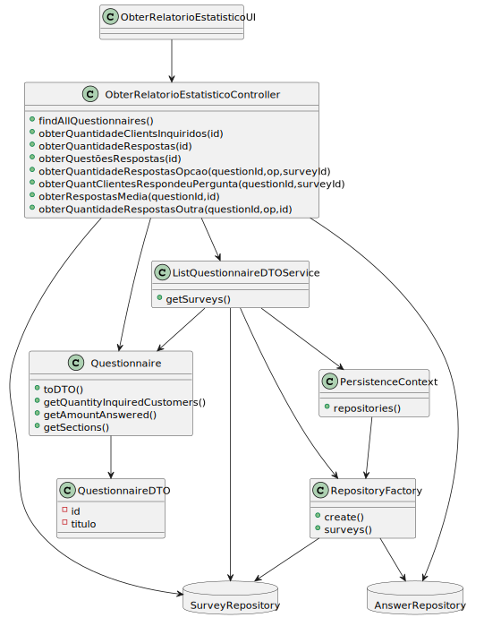

# US3002

# 1. Requisitos

As Sales Manager, I want to get a statistical report regarding a previously set up questionnaire.

## 1.1 Especificações e esclarecimentos do cliente

>[Question:](https://moodle.isep.ipp.pt/mod/forum/discuss.php?d=16836)
For this US, does the statistical report need to be shown to the SalesClerk or needs to be saved in some file too (p.e. text file)?
>
>[Answer:](https://moodle.isep.ipp.pt/mod/forum/discuss.php?d=16836#p21627)
The important is to show the statistical report.

>[Question:](https://moodle.isep.ipp.pt/mod/forum/discuss.php?d=16825#p21567)
For this US, what are the types of statistical report that Sales Clerk want to see?
>
>[Answer:](https://moodle.isep.ipp.pt/mod/forum/discuss.php?d=16825#p21624)
>Any report must have the basic:
> * Universe Size (implies knowing the amount of users the survey was distributed to);
> * Number of Responses Obtained
> * % of responses obtained;
>
>Further, something depending on the question type:
> * For “Single-Choice” questions:
>  * Distribution (in %) of responses for each alternative (e.g.: A = 30%, B = 27%, C = 40%, Others = 3%)
>
> * For “Multiple-Choice” questions:
>  * Distribution (in %) of responses for each alternative (e.g.: A = 30%, B = 27%, C = 40%, Others = 3%)
>  * Distribution (in %) of combined responses (e.g.: A+B = 15%, A+C = 100%, B+C=100%, A+B+C=10%)
>
>* For “Sorting-Options” questions:
>  * Distribution of the various hypotheses for each position (e.g.: 1st Place = A(40%) B (60%) C(0%); 2nd Place = A(50%) B(40%) C(10%); 3rd Place =A(10%) C(90%))
>
>* For “Scaling-Options” questions:
>  * Distribution of each option by scale levels.
>

# 2. Análise

## 2.1 Excerto do Modelo de Domínio

## 2.2 System Sequence Diagram

## 2.3 Explicação da User Story

# 3. Design

## 3.1. Realização da Funcionalidade

## 3.2. Diagrama de Classes

## 3.3. Padrões Aplicados

Foram aplicados os princípios SOLID e os padrões de design de software GoF. 

## 3.4. Testes 

**Teste 1:** Verificar que os dias em que o questionário se encontra ativo é determinado corretamente.

    @Test
    public void ensureActiveDays() {
        Calendar initialDate = Calendar.getInstance();
        initialDate.set(2021, 6, 12);
        Calendar finalDate = Calendar.getInstance();
        finalDate.set(2021, 6, 14);Period period = new Period(initialDate,finalDate);
        long result = period.getActiveDays();
        long expected = 2L;
        Assert.assertEquals(expected,result);
    }

# 4. Implementação

# 5. Integração/Demonstração

# 6. Observações

A notificação não está a ser enviada por email por questões do gmail ter bloqueado algumas
funcionalidades com aplicativos menos seguros.

